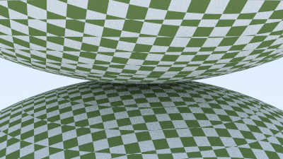

# Ray Tracing In One Weekend in Rust

yep, that's it.

## Latest render:

## Renders archive

Checkered spheres

Motion blur

In one weekend cover render

Depth of field

Materials

Fuzzy metals

Three spheres

## Dependencies

- [image](https://crates.io/crates/image): Saving bytes to image file.
- [rand](https://crates.io/crates/rand): Generating random numbers.
- [chrono](https://crates.io/crates/chrono): Purely just to log the time.
